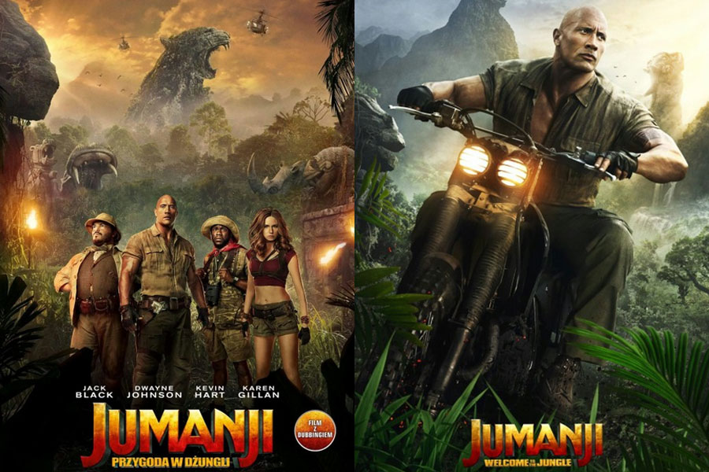

  #### Jumanji: Przygoda w dżungli
  
  
  ## Krótki opis filmu:
  *"Czworo przyjaciół odkrywa starą grę, która przenosi ich w świat dżungli. Aby powrócić do rzeczywistości, muszą stawić czoło niebezpiecznym przygodom."* - opis zaczerpnięty ze strony www.filmweb.pl

Link: http://www.filmweb.pl/film/Jumanji%3A+Przygoda+w+d%C5%BCungli-2017-717250


## Plakat promujący film:

 
## Bohaterowie:
 
- doktor Smolder Bravestone
- profesor Sheldon „Shelly” Oberon
- Ruby Roundhouse
- Franklin „Mouse” Finbar
- Jefferson „Seaplane” McDonough
- Van Pelt
- Nigel Billingsley
- Trader
- Spencer Gilpin
- Bethany Walker
- Martha Kaply
- dyrektor Bentley

 
## Ogólne informacje o filmie

| Reżyseria | Scenariusz | Gatunek  | Data premier  |
|-----------|------------|----------|---------------|
|Jake Kasdan| Kevin Hart |Przygodowy| 20.12.17 (USA)|      
|           | Nick Jonas | Fantasy  | 29.12.17 (PL) |

#### Film zarobił: 	**941,6 milionów USD**


## 3 ciekawostki oraz cytat

1. W serwisie Rotten Tomatoes, 78% ze stu pięćdziesięciu sześciu recenzji filmu jest pozytywne (średnia ocen wyniosła 6,1 na 10)
2. Na portalu Metacritic średnia ocen z 43 recenzji wyniosła 58 punktów na 100
3. Według pierwszych informacji premierę Jumanji 3 zaplanowano na Boże Narodzenie 2019 roku

`"It's a lot easier to be brave when you've got lives to spare. It's a lot harder when you only have one life."` - nawiązanie do utraty żyć w grze

### Koniec
```{r}
library(ggplot2)

ggplot(data = mpg) + 
  geom_histogram(mapping = aes(displ), binwidth = 0.2 ) +
  labs(title = "Rozkład pojemności silnika samochodów", x = "pojemność silnika", y = "liczba")

library(tidyverse)
diamonds %>% filter(cut == "Very Good")
```

  

